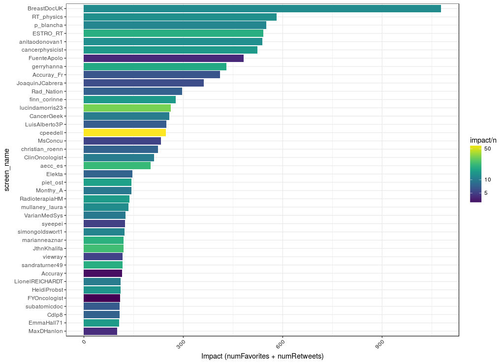
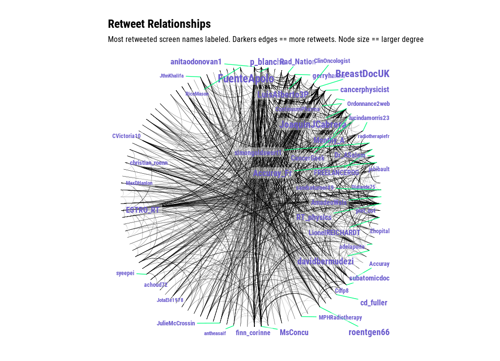

# An R analysis of the ESTRO37 conference

Need to fill in the blanks.

You can repeat this analysis by using rtweet if you are within 9 days of the conference (twitter has a ~9 window on searching into the past).

# Acknowledgements (i.e. where did I lift this code from)

I think it's always good to nod back to where you are grabbing code from; there is no (or should be) no shame in it. I've reinvented enough bad wheels that I'm happy to use someone else's better code when I recognize it and their license is cool with it.

So: much of this code is based of Mike Kearney's analysis of the [rstudio::conf tweet repo](https://github.com/mkearney/rstudioconf_tweets). 

The network plot comes from Bob Rudis's great [21 recipes for twitter](https://rud.is/books/21-recipes/) which has a bunch of nuts and bolts recipes for things you would want to do day to day in social network analysis with twitter data, using rtweet.

# Where's all the code?

For the code please go to [the Rmd](https://github.com/thomas-keller/ESTRO37/blob/master/estro37_v2.Rmd); it will have the R code and plots interwoven.

This README just has the plots.

timecourse:

sentiment (how many positive vs negative words are being used during a given period):

top 40 tweeters:

top 40 retweeters:

infuence (how many favorites and RTs did a person get? color divides "influence" by number of tweets to (poorly) adjust for prolific tweeters:

wordcloud (hate AND appreciate!):

mention network:

retweet network:

